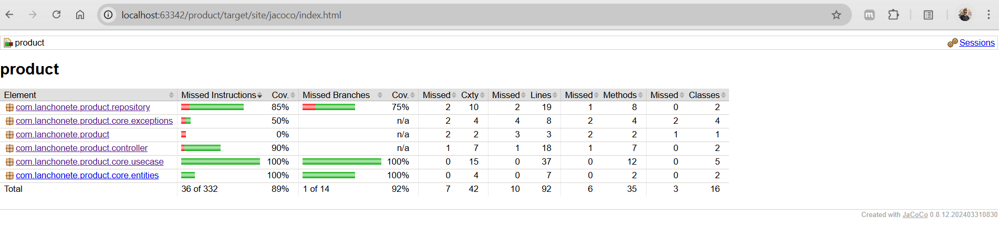

# Product Microservice

## Descrição

O **Product Microservice** é um microsserviço responsável pela gestão de produtos e categorias de produtos dentro do ecossistema da lanchonete. Ele permite criar, atualizar, remover e buscar produtos, bem como gerenciar categorias de produtos.

## Tecnologias Utilizadas

- **Java 17**
- **Spring Boot**
- **Lombok**
- **MongoDB**
- **Jakarta Validation**
- **Swagger (OpenAPI 3)**
- **Logback/SLF4J**

## Endpoints da API

### Produtos

- `POST /products` - Criar um novo produto
- `PUT /products` - Atualizar um produto existente
- `DELETE /products/{productId}` - Remover um produto
- `GET /products/{productId}` - Buscar um produto pelo ID

### Categorias

- `GET /products/categories/{categoryId}` - Buscar uma categoria pelo ID

### Cobertura de testes

